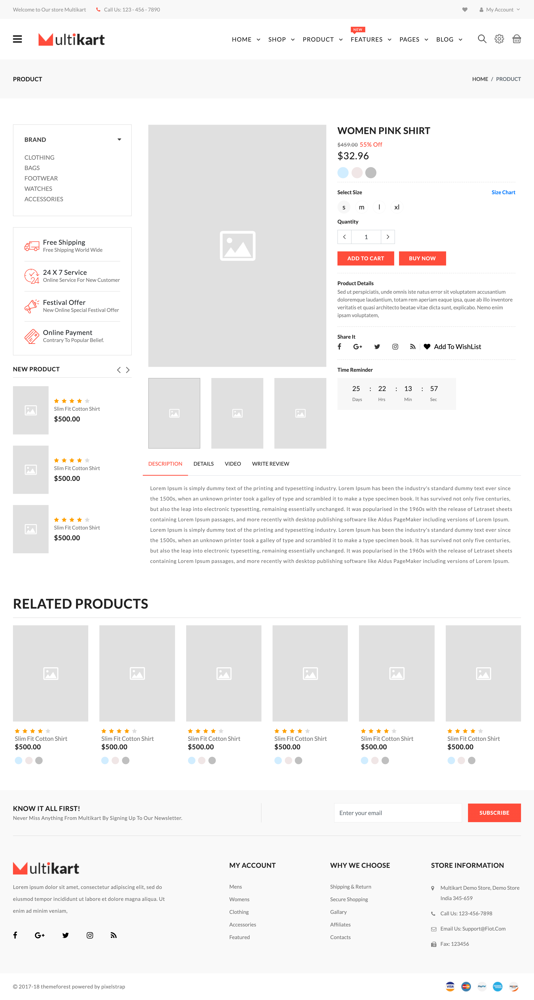

# Welcome to the eCommerce Project with Django 🌐

## Project Overview 🚀

This project is a hands-on exploration of building an eCommerce website using the Django web framework. It serves as an **educational resource** for those looking to gain practical experience in web development and Django specifically.

The frontend template used in this project has been sourced from the internet and is used for educational purposes only. We extend our thanks to the original creators for their work. Please note that this template is not intended for commercial use and may be subject to licensing restrictions.

## Project Origin 🎓

This project was developed as a part of the completion project for a software engineering bootcamp. It represents the culmination of the knowledge and skills acquired during the bootcamp's curriculum.

## Disclaimer ⚠️

**This project is for educational purposes only** and is not intended for production use. It should not be used as a basis for real-world eCommerce websites without significant security and scalability enhancements.

## Contributions 🤝

**Contributions to this project are welcome!** Feel free to fork the repository, make changes, and submit pull requests. However, please keep in mind the educational nature of this project and ensure that any contributions align with its goals.

## License 📜

This project is licensed under the **MIT License**.

Happy learning and coding! 🌟

<!-- 
# E-commerce-Multikart
 

POSTGRES_PASSWORD=12345
POSTGRES_USER=user
POSTGRES_DB=multikart
POSTGRES_PORT=5432
POSTGRES_HOST=db

REDIS_HOST=redisdb
REDIS_PORT=6379

-->

